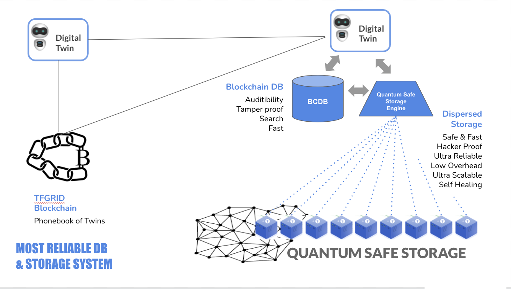

# Twin Phonebook 

As mentioned on the [Planetary Secure Network](planetary_secure_network), Threefold Grid Blockchain, built on top of Substrate, will act as a “Phonebook” for Digital Twin. Furthermore, given your Twin’s unique ID (or any unique information), your Digital Twin will look up for all necessary information to connect to other Twins. 

## Data request between Digital Twins using Twin Phonebook 

Above is a high-level overview of how you can request data from another Twin by connecting to your own Digital Twin. Moreover, this process integrates the Phonebook (Threefold Grid Blockchain) for security. 

## An overview of how it works

**Step 1**: Your phone connects to your own Digital Twin. It instructs the Twin to fetch some piece of data (In the example above video). Two IDs can identify every item: *Twin ID* (The ID of the Digital Twin which stores the data) and *Content ID* (a unique ID for this Digital Twin used to recover the data). 

**Step 2**: Your phone instructs your Digital Twin to fetch the piece of content identified by this Twin ID and Content ID. Your Twin searches the address of the other Twin in the phonebook using the IDs. Then, your Digital Twin connects to the other Twin and ask for the content identified by the Content ID. 

**Step 3**: The remote Twin (Digital Twin of the video owner) receives the request and verifies your Digital Twin identity through the Twin Phonebook. 

**Step 4**: It will check if you can view this content using the [3Bot Blockchain](threefold:usp_secure). 

**Step 5**: If you are allowed, it will fetch the content from the [Quantum Safe Storage](qsstoragesystem).

**Step 6**: The video is now being streamed back to your Digital Twin. 

**Step 7**: The video is then streamed back to your phone, where you can enjoy the experience. 

## Your Digital Twin ecosystem

The above infographic illustrates the ecosystem when two Digital Twins are interacting with each other. It also shows the Twins' capabilities along with what data is being stored on the Twin Phonebook. 

## Authentification security system 

This infographic is a high-level view of the Quantum-Safe Storage, showing how the 3Bot can use it for authorization purpose. The Blockchain Database (BCDB) is a separate component that governs access control. Therefore, if your Digital Twin allows access for a specific component, the other Twin will see this piece of content. 

Learn more about the Blockchain Database (BCDB), [here](bcdb_0db).

!!!def alisa:digitaltwin_phonebook,twin_phonebook