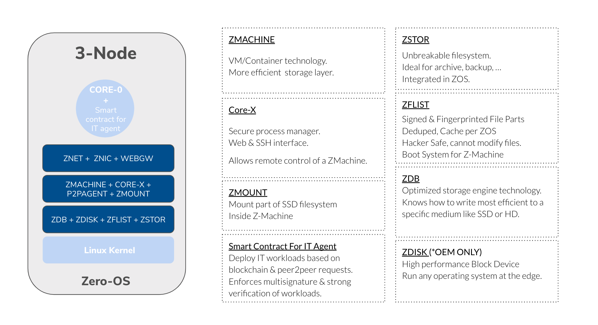
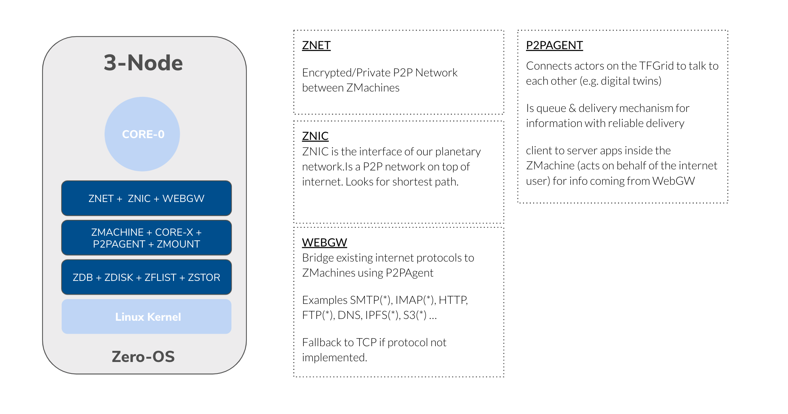

# Zero-OS Primitives

Built on top of the ThreeFold Grid, Digital Self uses lightweight and cutting-edge Zero-OS primitives to create a fully autonomous and self-healing system. 

## Compute and Storage 

### ZMachine 

**ZMachine** is ThreeFold native container technology implemented in Zero-OS and is fully compatible with Docker. Moreover, to increase security and allow different kernels to be used, ZMachine contains Virtual Machine (VM) Support.

Learn more about ZMachine [here](threefold:zmachine).

### CoreX

**CoreX** is an optional tool that allows users to manage their ZMachine over the web remotely 

### ZOS Filesystem 

**ZOS Filesystem** is a small database that contains metadata about files and directories and file payloads are stored on a ThreeFold Grid Hub. Users only need to download payload when they need it and thus reducing ZMachine boot time, bandwidth, and disk overhead. 

Learn more about ZOS Filesystem [here](threefold:zos_fs).

### ZMount 

**ZMount** is a partition on an SSD disk and is mounted underneath the ZMachine. It is fast storage and typically used for databases. 

### Zero-DB 

**Zero-DB** is a super fast and efficient always append database supporting a subset of the popular Redis protocol. It has superior write performance on the hard disk and can also extend the life of solid-state disks while executing up to 50,000 transactions per second. Zero-DB is suitable out of the box for many database applications and is a building block for advanced storage solutions.

### ZSTOR

**ZSTOR** is a distributed and ultra-secure storage backend. It compresses, encrypts, and disperses data across a set of Zdbs, to achieve strong resistance to even quantum computing attacks. Flexible configurations enable tuning according to preferences for efficiency, resiliency, and data location. Scales limitlessly and heals seamlessly.

### Zero-DB Filesystem 

An optimized filesystem frontend for **Zdb**, with built-in archival features. Works together with ZStor to create a highly compatible and extremely secure storage solution, called Quantum Safe Filesystem.

Learn more about Quantum Safe Storage System [here](qsfs).

### ZDisk 

Virtual Disk creates the possibility to create and use virtual disks which can be attached to containers (and virtual machines). 

The technology is designed to be redundant without having to do anything. 

### KVS (Blockchain-based Key-value Store )

**KVS** is a Key-Value store on the Blockchain (Substrate or tendermint/cosmos), you can store small (up to 500 bytes) datasets either encrypted or in plaintext. KVS can be used to verify data like DID/KYC, file hashes, and more.

## Network 

### Z-NET

**Z-Net** is a decentralized networking platform allowing any compute and storage workload to be connected on a private (overlay) network and exposed to the existing internet network. It is the foundation of any architecture running on the ThreeFold Grid. 

Learn more about Z-Net [here](threefold:znet). 

### Planetary Network 

**Planetary Network** is an overlay network that lives on top of the existing internet or other peer-to-peer network created - A network where everyone is connected to everyone through an end-to-end encryption system without any intermediaries. 

All traffic between two Digital Selves will go over this Planetary Network. 

Learn more about Planetary Network [here](threefold:planetary_network). 

### ZNIC 

**ZNIC** is the interface of the Planetary Network. It is a peer-to-peer network built on top of the ThreeFold Grid and looks for the shortest communication path between two Digital Selves. 
 
### Web Gateway 

**Web Gateways** provide a bridge between private overlay networks and the public Internet. They handle inbound connections in a unique way that protects workloads from attack while supporting standard use cases out of the box.

Learn more about Web Gateway [here](threefold:webgw).
