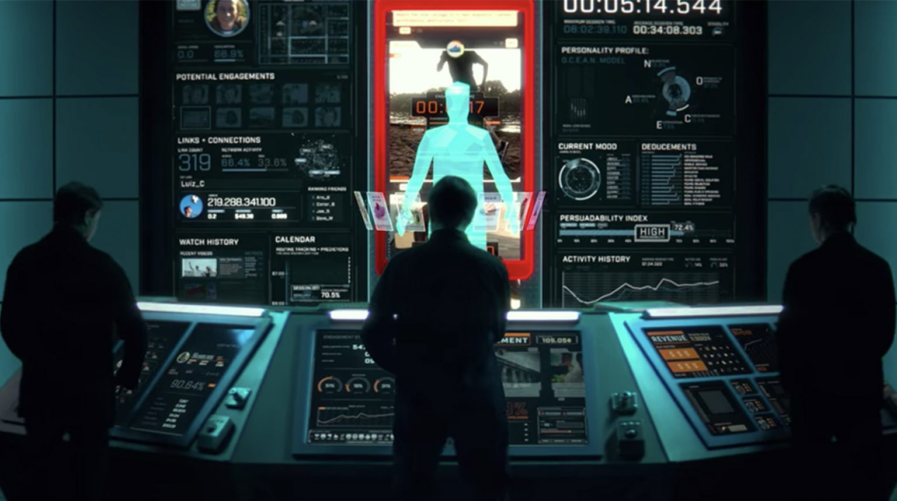

# Our Digital Problem 

The Internet was meant to be different. In the beginning, no one would own the Internet. No one could own the Internet. The Internet belonged to all of us. We live in a technological miasma where beyond our control and comprehension, the Internet lost its edge.  It became about monetizing your clicks and swipes and getting you algorithmically addicted to their application, software, or platform. 

Our lives have become almost entirely dependent on digital processes, which has necessitated the creation of multiple digital identities. We should feel safe in the knowledge that our online accounts are being managed in ways that respect our personal data, kept firmly out of the hands of malicious third parties. It is no secret that many of the companies responsible for our personal data are mining it for their own benefit. It's obvious that we've lost control of our personal identities and data. But how did we end up in this situation? 

## Centralized infrastructure 

Today, more than 80% of the internet's capacity is owned by centralized cloud providers. The capacity is derived from hyper-scale data centers - an incredibly costly infrastructure, not scalable and super unsustainable. As of today, the internet consumes about 10% of global energy resources. 

These data centers, which are located in a handful of locations in wealthy nations, are where all of your crucial data is currently stored. All of your unique information and part of your digital identity is tracked, stored, and used by third parties. 

## Multiple digital identities 

All the tiny bits of collected data, when pieced together, create a profile of yourself called digital doppelgänger to indicates your taste, buying habits, sexual preferences, health data and much more. Everyone has, approximately, hundreds to thousands of digital doppelgängers held by those third parties (Privacy International, 2020). The reason is to predict your behavior and use it to their advantage.

# A Unique Digital Self 

By combining itself with ThreeFold Technology, Digital Self is your unique digital identity on the first peer-to-peer internet. Being fully autonomous, it will make sure that each person communicates directly with each other and everyone has full control over his/her data. It is the bridge towards a fully sovereign digital life. 

Learn more about our [Web 4.0 Vision](vision).

