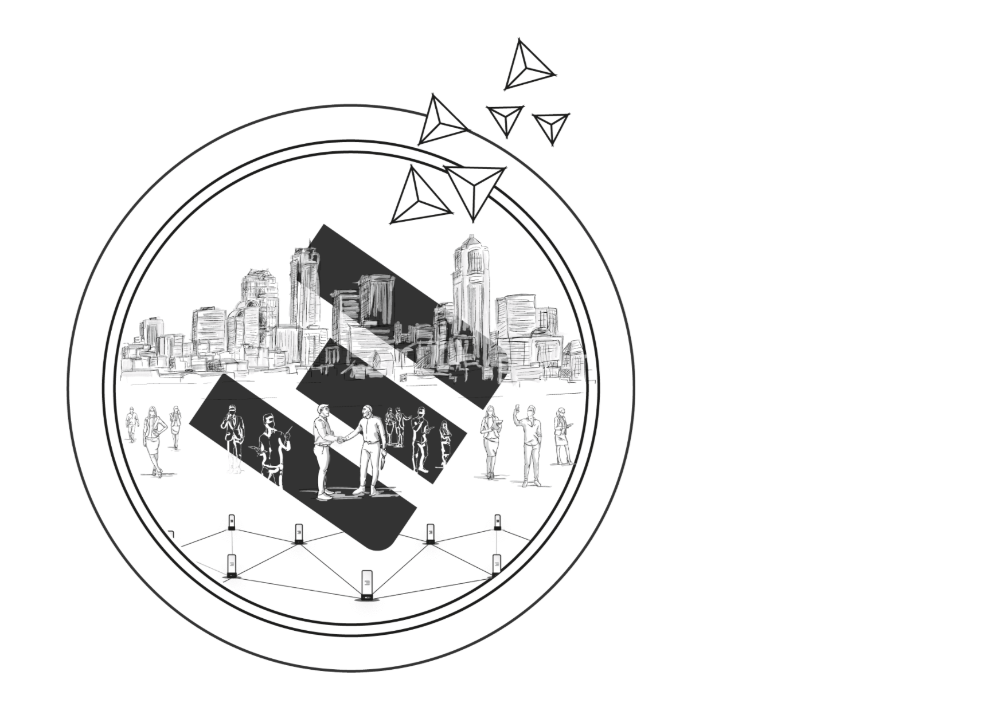

# Your Digital Self

Welcome to the Digital Self Wiki. Here you will find all relevant information around Digital Self, ThreeFold and its ecosystem. 

If you are new to our project, we recommend you to start with "What is ThreeFold all about?" and then dive-in our knowledge-based. 

## What is ThreeFold all about?

Read **[this simplified introduction](tf_longstoryshort)** or watch the short video below:

<iframe width="560" height="315" src="https://www.youtube.com/embed/5DtVU66Z74s" frameborder="0" allow="accelerometer; autoplay; encrypted-media; gyroscope; picture-in-picture" allowfullscreen></iframe>

If you are **a bit more technical**, here's [a longer video explanation](tf_howitworks).

And **check out this video** on how it all started and what we have accomplished already.

<iframe width="560" height="315" src="https://www.youtube.com/embed/AAV4yYZ_P3k" frameborder="0" allow="accelerometer; autoplay; encrypted-media; gyroscope; picture-in-picture" allowfullscreen></iframe>

## More Online Resources 

For additional information, please refer to the following official channels: 

- **[ThreeFold Website](https://threefold.io)**: Helps you navigate throughout the ThreeFold universe based on your interest(s) in the project.
    - **[Be The Internet](https://farming.threefold.io)**: Join the Internet economy by hosting a server at your home or office.
    - **[Alliance for a Conscious Internet](https://consciousinternet.org)**: A collective ecosystem of planet and human centric projects.
    - **[ThreeFold Marketplace](https://marketplace.threefold.io)**: Empower your community with peer-to-peer applications and tools.
    - **[Your P2P Cloud](https://cloud.threefold.io)**: Build secure software, applications, and open Internet services.
    - **[The Antidote to the Cyber Pandemic](https://threefold.tech)**: Dig deeper into the technology behind the TF Grid.
- **[ThreeFold Wiki](https://info.threefold.io/#/)**: Access to all the information regarding ThreeFold and the technology behind. 
- **[ThreeFold News Telegram Channel](https://t.me/threefoldnews)**: Stay updated on what is our most recent announcements and updates.
- **[The ThreeFold Forum](https://forum.threefold.io)**: The perfect place for you to share, connect, & ask questions.

